# THU 2024 春 计算机图形学基础大作业（42.5分/45分，已完结，欢迎补充纠错）

## 如果您是清华大学计算机系《计算机图形学基础》课程的学生，请绝对不要抄袭代码。课程查重中将包含有往年同学的代码。抄袭行为将导致挂科

## 本仓库设立的目的并不是让你来抄作业的，是给你梳理一些功能点的实现思路的。抄袭我让你飞起来。

- [THU 2024 春 计算机图形学基础大作业（42.5分/45分，已完结，欢迎补充纠错）](#thu-2024-春-计算机图形学基础大作业425分45分已完结欢迎补充纠错)
  - [说在前面](#说在前面)
  - [致谢与参考](#致谢与参考)
  - [一、 效果图](#一-效果图)
    - [路径追踪：](#路径追踪)
  - [](#)
    - [glossy材质：](#glossy材质)
  - [](#-1)
    - [Next Event Estimation(NEE):](#next-event-estimationnee)
  - [](#-2)
    - [景深：](#景深)
  - [](#-3)
    - [纹理贴图：](#纹理贴图)
  - [](#-4)
    - [参数曲面求交：](#参数曲面求交)
  - [](#-5)
    - [运动模糊](#运动模糊)
  - [二、 大作业要求](#二-大作业要求)
  - [三. 对大作业的感受](#三-对大作业的感受)
    - [3.1 对我实现的功能点的感受](#31-对我实现的功能点的感受)
    - [3.2 对实现顺序的感受](#32-对实现顺序的感受)
  - [四、具体功能实现讲解](#四具体功能实现讲解)
    - [4.1 参考smallpt的path tracing：漫反射、理想反射、理想折射、cos-weighted采样、抗锯齿](#41-参考smallpt的path-tracing漫反射理想反射理想折射cos-weighted采样抗锯齿)
      - [4.1.1 path tracing的过程：](#411-path-tracing的过程)
      - [4.1.2 实现path tracing的前置条件](#412-实现path-tracing的前置条件)
      - [4.1.3 path tracing 出射方向的计算](#413-path-tracing-出射方向的计算)
      - [4.1.4 OPENMP加速](#414-openmp加速)
      - [4.1.5 代码讲解：path\_tracing.hpp](#415-代码讲解path_tracinghpp)
    - [4.2 glossy材质](#42-glossy材质)
      - [4.2.1 概念讲解](#421-概念讲解)
      - [4.2.2 前置条件](#422-前置条件)
      - [4.2.3 pathTracer 主体函数](#423-pathtracer-主体函数)
      - [4.2.4 glossy原始公式](#424-glossy原始公式)
      - [4.2.5 glossy 具体分量的计算：F  D  G](#425-glossy-具体分量的计算f--d--g)
      - [4.2.6 glossy最终的公式计算](#426-glossy最终的公式计算)
    - [4.3 Next Event Estimation](#43-next-event-estimation)
      - [4.3.1 NEE的概念](#431-nee的概念)
    - [4.4 运动模糊：以球为例](#44-运动模糊以球为例)
      - [4.4.1 概念讲解](#441-概念讲解)
      - [4.4.2 实现细节](#442-实现细节)
    - [4.5 景深相机](#45-景深相机)
    - [4.6 纹理贴图](#46-纹理贴图)
      - [4.6.1 根据二维求得图片对应位置的颜色](#461-根据二维求得图片对应位置的颜色)
      - [4.6.2 从三维到二维](#462-从三维到二维)
    - [4.7 参数曲面求交](#47-参数曲面求交)
      - [4.7.1 总体思路](#471-总体思路)
      - [4.7.2 迭代方程推导](#472-迭代方程推导)
      - [4.7.3 迭代代码](#473-迭代代码)


## 说在前面
本仓库的大作业满分45，拿了42.5分

本仓库不保证完全正确，欢迎纠错和补充。

本仓库的价值**不在代码，而在该README文件**

该仓库是贵系的一个菜鸡在被图形学折磨了一个星期后有感而发。

如果您是贵系大佬，请您移步其他仓库，因为本仓库可能并不能满足您的胃口。你并不能从该仓库中获得许多功能点的实现，甚至其中有的功能点至今仍有问题。

那我为什么要建立这个仓库呢？

图形学大作业之难度，讲解之匮乏，ppt之混乱，是我前所未见的。

本学期我有两个大作业：软工和图形学。这两个大作业都有着`讲解缺乏、上手困难`的问题。

软工给人的感觉是虽上手难，但熟练之后工作效率提高很多，“条条大路通罗马”，而且对查重要求很低；图形学给人的感觉是很难，而且路径十分有限，自己硬想一天不如别人点醒一句。

再加上课程ppt中对于参数定义十分繁杂且混乱，有时候看公式根本不知道对应什么东西，甚至能出现 `变量 + 常量`的公式（说的就是cook torrance）。

所以被折磨后，我希望能借此文件帮助同学`快速上手图形学作业`。我将在该文件中，`讲解我实现的功能点的实现路径`，防止出现看着学长的代码都不知道怎么抄的情况。

## 致谢与参考
在这里远程感谢以下代码对我写大作业的帮助：

[学长的代码](https://github.com/zhanglbthu/THU2023Spring-CG-FinalProject) 实现了

- whitted style光线追踪（疑似有bug）
- path tracing，不包括NEE、glossy材质
- 参数曲面求交（有明显的bug，可能他报告里的图不是他生成的）
- **OPENMP加速（不作为得分点，但可以大大减少渲染时间，从而更快出结果）**
- 光子映射（不再得分，因为太多人抄往年的这个算法）
- 纹理贴图
- 景深相机
- cos-weighted采样
- 抗锯齿（然而抗的效果并不好）
- 复杂三角网格（我没写，不敢保证他的一定对）
- 包围盒（同上）
- BVH树（同上）
- 法向插值（同上）


[smallpt](https://blog.csdn.net/g11d111/article/details/108189198) 请不要看99行的，去看二百多行的。其中包含

- path tracing，包括NEE，不包括glossy材质
- 抗锯齿（效果很好，但是时间耗费更多，约是上面学长的四倍）
- OPENMP加速
- cos-weighted采样

[基于cook-torrance模型实现glossy材质](https://zhuanlan.zhihu.com/p/160804623)
- 如题，其效果确实好，但有需要注意的地方，见后 [glossy材质](#42-glossy材质)

以及我的同学 ls、mxy、jyx、lh 对我的帮助
## 一、 效果图
### 路径追踪：
包括漫反射（左右墙壁）、理想反射（左边球）、理想折射（右边球）、抗锯齿

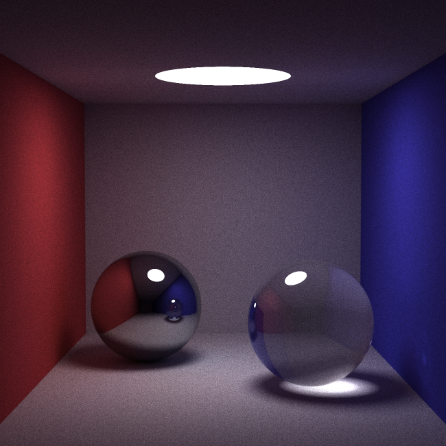
-
### glossy材质：

一种哑光粗糙面

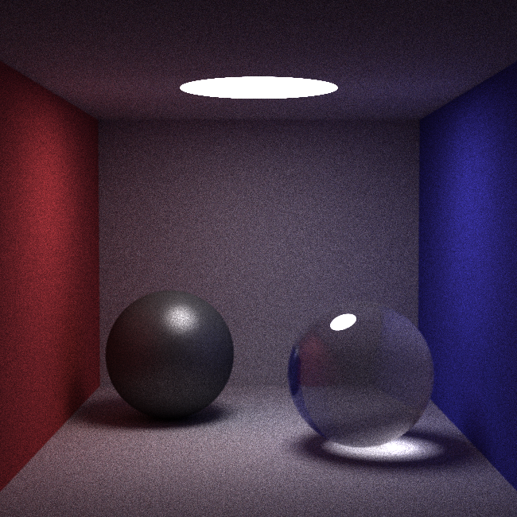
-
### Next Event Estimation(NEE):

以更少的samplesPerPixel（spp，这个概念在后面讲到）获得更好的效果。第一张图为 NEE在20spp的结果，第二张图为 无NEE在20spp的结果

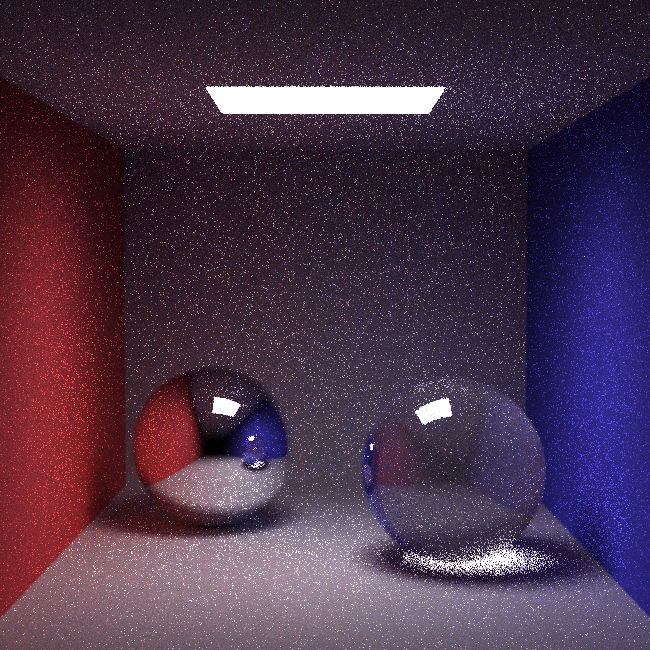
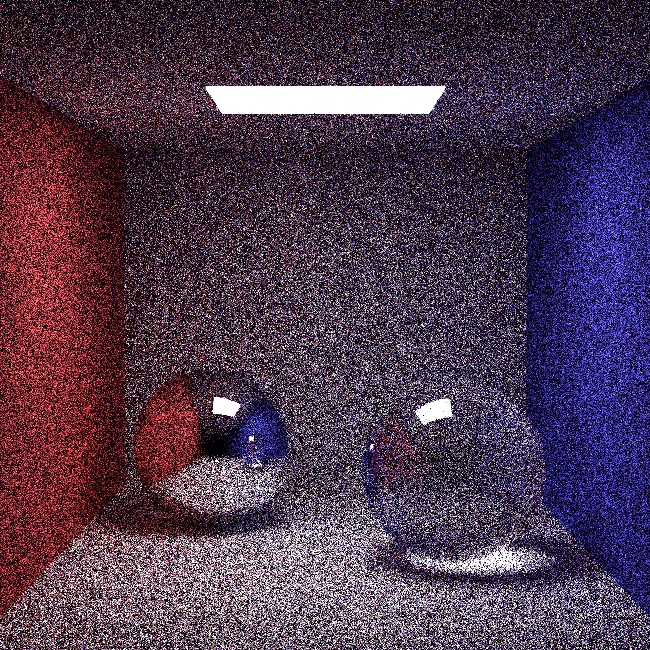
-
### 景深：

焦距处的物体清晰，其他地方的物体模糊
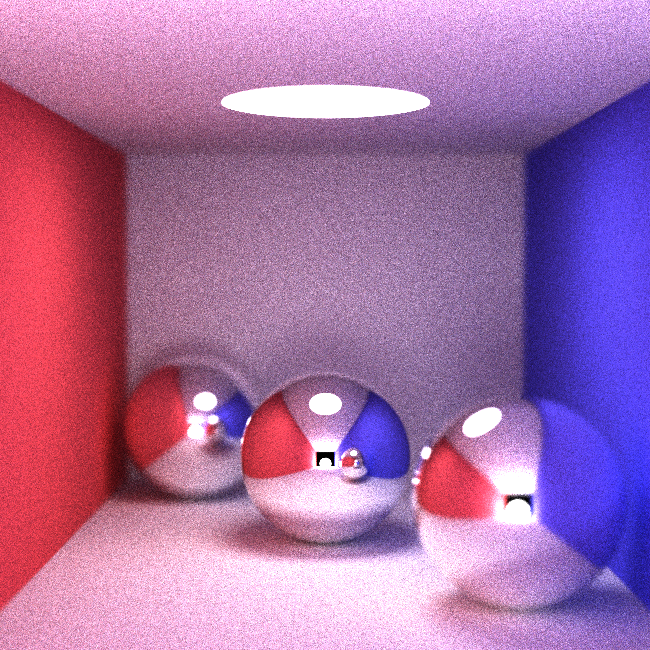
-
### 纹理贴图：

把二维图片贴到三维物体上
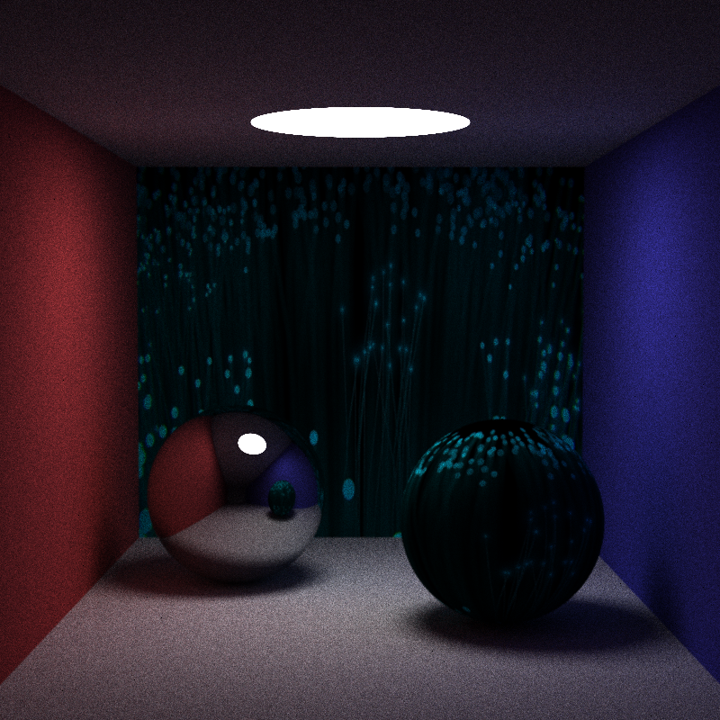
-
### 参数曲面求交：

PA2中我们是用OPENGL自动算求交的（当然大作业肯定是不能用OPENGL），所以如果你发现自己的ray tracing或者path tracing跑PA2的测例是空的，就是因为你没有自己写求交。下面的图在与视线平齐的地方有瑕疵，但比学长的好。学长的半个花瓶都变成背面了

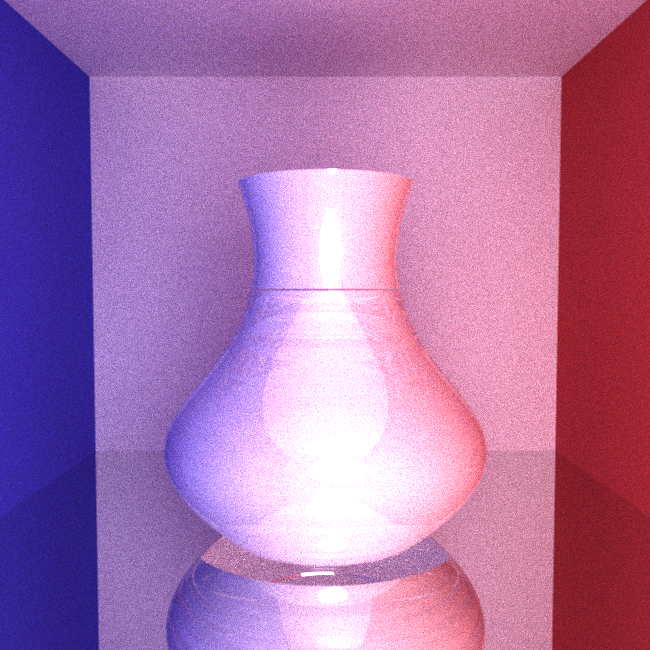
-
### 运动模糊
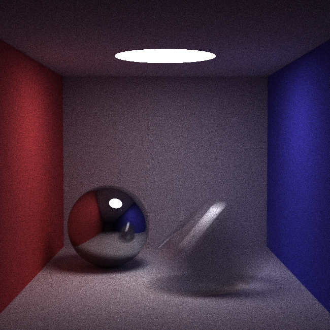

## 二、 大作业要求
详见本仓库 “大作业要求.txt”
## 三. 对大作业的感受
### 3.1 对我实现的功能点的感受

由于本菜鸡并没有实现其他功能，所以对其他的难度并不知晓。

如果你照着smallpt（99行）写的基础的path tracing，那么已经有了cos-weighted采样、抗锯齿这两个加分项。如果你照着smallpt（二百多行）写的，那么应该有NEE了。

cos-weighted采样，smallpt本身就用的这个方法，所以照着smallpt写自动获得这个加分项。**但是助教说：因为smallpt有，所以这个采样相较于其他的采样，分值会更低**

抗锯齿，smallpt本身就有抗锯齿，效果很好但是**需要更多渲染时间**

glossy材质**不要看ppt！！！不要看ppt！！！不要看ppt！！！**看ppt不如看我给你讲。[glossy](#42-glossy材质)

参数曲面求交，作为高加分项，难度确实大，而且直到ddl我都没有解决在与视线平齐的求交问题。不知道能拿几分。

景深较为简单，只需要改一个文件，写一个类即可。

运动模糊也较为简单。如果你只写球的运动模糊，只需要在大作业前的代码基础上加一行代码即可（前提是你已经有了path tracing）

纹理贴图的代码量相比较于分值来说较大。如果只实现球的贴图、平面贴图的话难度不大。**注意：实现曲面贴图的前置条件是实现曲面求交**


### 3.2 对实现顺序的感受
虽然要求中建议你先实现whitted-style ray tracing，但是我建议直接写path tracing。

一方面，path tracing有现成的smallpt的代码，照抄再改改一定能出来，而whitted-style的代码少的可怜，至少我没找到很好的，不管是学长的还是其他的

另一方面，最后验收分数，如果你有path tracing的话，直接给到path tracing的分（包括了whitted-style），而whitted-style的给分只是在你没写path tracing的时候才细看的。

所以我也不讲whitted-style了，仓库里也没有。因为我的whitted-style可能遗留了未解决的问题。

## 四、具体功能实现讲解
在这一节中，我不会将具体的公式原理，因为我也看不懂。我会从基于PA2的代码开始，告诉你需要修改哪些文件、需要添加哪些参数。具体的代码还得自己写。

**查重越来越严格了！！！**

### 4.1 参考smallpt的path tracing：漫反射、理想反射、理想折射、cos-weighted采样、抗锯齿
path tracing的原理，不讲，网上一堆。

#### 4.1.1 path tracing的过程：

1. 和光线投射一样，从相机到像素点产生光线，然后光线与场景中的物体求交，这个光线称为**入射光线**

2. 求交之后，我们根据不同的材质，计算出不同的出射方向，以交点为新的起点，出射方向为光线方向，这个光线成为**出射光线**，然后对出射光线递归，递归的结果乘交点处的`diffuseColor`，再加上交点处的自发光的颜色。这就是计算得到的颜色

#### 4.1.2 实现path tracing的前置条件
上面的`diffuseColor`，和光线投射中的`diffuseColor`是同一个。为什么是同一个呢？你可以把`diffuseColor`理解为，光线打到这个点后，颜色（三维向量）的**RGB三个分量的衰减率**。

而我们所谓的“入射光线”，其实是按照光路的可逆原理的，从交点到相机的光线的反向。所谓的“出射光线”，才是真实的光线。所以我们要把递归得到的结果乘以这个点的衰减率。

既然是衰减率，那么一定是在[0,1]之间。这从直观上也很好理解：这个点最多就把递归的结果（即递归得到的颜色）原样返回，而不会增强返回。如果增强的话，颜色值凭空变大，意味着能量凭空变多。**这个概念有助于我们理解glossy材质的实现。**

由于不同的材质，出射方向也不同，所以我们需要对不同的材质做区分。这就需要对`Matetial`类进行修改。

目前我们需要区分三种材质：漫反射、理想反射、理想折射。通俗地可以把他们理解成：水泥墙、镜子、玻璃。所以可以用一个`Vector3f`来区分，三个分量分别对应三种材料。每种材料对应的分量为 1，其他分量为 0。
```
Vector3f type;  // (漫反射，理想反射，理想折射)
```

注意：我们无需实现混合效果，所以互斥的分量是完全可以的。

注意：所谓“理想折射材质”，也就是“玻璃”材质，在效果上既有折射现象又有反射现象。

既然有折射，那就需要有折射率，所以又需要加变量：
```
float refractiveIndex;    // 折射率
```

然后，上面提到 “要加上交点处的自发光的颜色”。这是因为path tracing我们是对光线递归，如果递归的光线没有打到光源，则就是一片漆黑。

而**点光源很小，光线很难打得到**。所以我们需要面光源！

如何实现面光源呢？我们可以让物体发光！

物体如何发光？给`Material`类加变量，这就是自发光项。一个三维变量，代表这个材质发光的颜色。
```
Vector3f emission;    // 自发光项
```

总结一下，到此你的`Material`类，加上之前PA的框架，应该有这些变量：

```
Vector3f diffuseColor;   // 漫反射颜色
Vector3f specularColor;  // 反射颜色
float shininess;         // 锐利度

float refractiveIndex;   // 折射率
Vector3f type;           // （漫反射，镜面反射, 折射）
Vector3f emission;       // 自发光项
```

这些参数都是从测例中读取的，而读取的函数是`SceneParser`类，所以我们还需要修改`SceneParser`类中对`Material`类的读取。

后面的讲解中，如果修改了某些类，一般都需要修改对应的`SceneParser`类的读取函数。如果我忘了，读者别忘。

#### 4.1.3 path tracing 出射方向的计算
目前，我们能够区分三种材质，那么接下来我们就需要计算不同材质的出射光线的方向。

首先，最简单的是理想反射，直接套公式即可，不讲。

然后是漫反射。什么是漫反射？光线打到面上后向半球面的每个方向都会有光线出去。这就有两个问题：

1. 不同方向的出射光线的占比是多少？（我对概念的理解非常混乱，懂我意思就行）

这个问题对应到要求中的“采样方法”，采样方法就是，不同方向的出射光线占多少比例。

我们当然可以采取均匀取样，即不同方向的出射光线的比例都相同。这里我们讲解smallpt实现的cos-weighted采样。

cos-weighted采样，即出射光线的立体角与交点的法向的夹角的余弦值越大，占比越高。具体的推导请上网查。

2. 半球面理论上有无穷多个方向，而不同的方向可能占比都不一样，我们该怎么计算如此多的方向？

如果每次仅递归有限个方向，少了：计算结果并不准确；多了：递归爆炸。

这就是基础要求中的**蒙特卡洛积分**。如果你这学期上了《人工智能导论》，那么此时你应该对四子棋大作业中的蒙特卡洛模拟有了感受。我对蒙特卡洛方法浅显的理解是，**占比即概率，用概率 + 大量模拟**的方法，来近似计算我们需要的结果。

所以我们的处理方法是：**按照概率来每次随机选取一个出射的方向，然后每层递归只递归这一个方向，通过对每个像素点发出许多条光线，来近似模拟得到不同方向的占比**。

最后是折射。首先根据公式计算折射后的方向。

注意需要判断折射是从介质（折射率大于1）到空气（折射率等于1），还是从空气到介质。如果是前者，需要判断是否发生全反射现象。

然而，光线打到折射的物体表面，并不会完全进入物体，还是有部分光线被反射了的。也就是说，**我们定义的“理想折射”材质，最终实现效果既有折射现象，又有反射现象**

反射的光线占多少呢？这就需要菲涅尔方程来计算。然而这个方程计算十分复杂，所以我们用 Schlick近似来近似计算反射光线的占比。具体的计算请自行查阅。

然后“占比”即概率，按照概率随机选择我们要取反射方向还是折射方向，通过大量模拟来近似占比。

那反射的方向是固定的，怎么办呢？同样进行蒙特卡洛模拟，既然是固定的，采样很多次也不会影响结果，取平均就好。

#### 4.1.4 OPENMP加速
在`path_tracing.hpp`中你能看到这个
```
#pragma omp parallel for schedule(dynamic, 1)
```
这是使用了OPENMP进行多线程（并行）的计算后面的循环，能够明显减少渲染的时间。

**重要：如果你在代码中使用了打印内容来debug，请关闭OPENMP加速，因为并行的运行循环会让你的输出混乱**

如果想要使用OPENMP（我也建议使用），请在`CMakeLists.txt`中加入以下内容，加入的位置参考我的文件：

```
SET(CMAKE_BUILD_TYPE "Release")
SET(CMAKE_CXX_FLAGS_DEBUG "$ENV{CXXFLAGS} -O0 -Wall -g2 -ggdb -fopenmp")
SET(CMAKE_CXX_FLAGS_RELEASE "$ENV{CXXFLAGS} -O3 -Wall -fopenmp")
```

#### 4.1.5 代码讲解：path_tracing.hpp
在path_tracing.hpp代码中，有两个函数：`render`, `pathTracer`。

`render`负责文件的读取、相机到像素的光线的产生。

`pathTracer`负责对于一条光线，计算返回的颜色。

在`render`中，你能看到对每个像素点，调用了`samplesPerPixel`次`pathTracer`，然后取平均。这里就是在利用蒙特卡洛方法，大量模拟次数。`samplesPerPixel`，即前面提到的`spp`，就是我们对每个像素采样多少次。

理论上采样次数多一些效果更好。如果你在debug期间，建议采样几百到1k次，并将图片的像素调低，以减少渲染时间（在testcases的相机中修改width和height，例如改为200）。如果你已经实现好，要得到报告用图片，建议渲染1k次以上，像素在640*480以上（作业要求）。

这个spp是不使用NEE的情况下，能有比较好的效果。如果使用NEE，那么用更少的spp即可获得差不多的效果。


在`render`中产生像素(i, j)对应光线的时候，加入了一个随机数的扰动。这是比较弱的抗锯齿。比较强的抗锯齿请参考smallpt。其方法是在计算(i, j)处像素颜色时，取其附近四个像素点，分别采样`spp`次取平均，再对四个像素取平均。效果更好，速度更慢，建议不要将这个在debug期间使用。

在`pathTracer`中，我们是按照`Material->type`的三个分量，作为该材质在三种材质上的占比。这种实现实际上包含了三种材质的混合，然而我们无需实现混合。

所以如果你保证在输入文件中，`type`的三个分量互斥（只有一个为1），那么也可以通过判断三个分量是否大于零来判断是哪种材质。

`pathTracer`中，对于漫反射、理想反射、理想折射的方向的计算，调用了对应的函数，请自己阅读源代码。

俄罗斯轮盘赌：递归达到一定深度后，按照某个概率来决定该次递归是否要停止。这个概率自己定，可以是常量（如我的代码），也可以是动态计算的量（如smallpt的代码）。
```
hit_color = hit_color * (1.0 / P_RR);
```
这里为什么要乘后一项，我觉得是为了使得蒙特卡洛模拟计算出的为无偏期望。无偏期望的概念请参考《概率论与数理统计》课程。为什么这样是无偏的请自己研究，我也不会。

到这里，我们目前已经实现了最基础的光线追踪算法。

### 4.2 glossy材质

#### 4.2.1 概念讲解
这里我们参考[基于cook-torrance模型实现glossy材质](https://zhuanlan.zhihu.com/p/160804623)来实现glossy材质。

glossy材质在path tracing中如何处理？请看代码，唯一的变化就是，将原本静态的`hit_color`，变为了一个函数`glossy`，相当于对`hit_color`重新赋值。

#### 4.2.2 前置条件
glossy材质类似一种粗糙的金属材质，其特点是模糊的光晕效果。具体请参考之前的图片。

glossy材质是独立于 漫反射、理想反射、理想折射之外的第四种材质，所以我们又需要对其在`material`类中加以区分。

glossy材质有一个额外的参数：粗糙度。不同粗糙度的效果请参考上面的链接。

所以`material`类又需要加入新的变量：
```
    bool glossy;         // 是否是glossy材质
    float roughness;     // 粗糙度
```
在这里，为了方便，我默认所有的glossy的粗糙度都为 0.1，实际中你可以指定粗糙度。

#### 4.2.3 pathTracer 主体函数
在path tracing主体函数中，我们应当把glossy独立于前面三种材质。也可以像我这样处理：

```
如果一个材质的 type 为(1, 0, 0)，且 glossy 变量为 true，则其为glossy材质；否则为普通的漫反射材质。
```

上面这样做，相当于把glossy集成到了漫反射中。因为glossy的出射光线的方向和漫反射是一样的。

#### 4.2.4 glossy原始公式
在计算glossy的函数`glossy`中，对其中一些变量的命名加以声明。

```
Vector3f rho； // 交点处的颜色，即diffuseColor
float d = 1;   // 漫反射系数，自己设置具体的数值
float s = 20;  // 镜面反射系数，自己设置具体的数值
Vector3f l;    // 入射光线的方向的反方向。入射光线：即pathTracer的参数ray。反方向：保证其指向平面外
Vector3f v;    // 按照漫反射计算的出射光线的方向
Vector3f n;    // 交点处的法向
Vector3f h;    // l和v的角平分线
```

glossy的总体计算公式参考ppt：

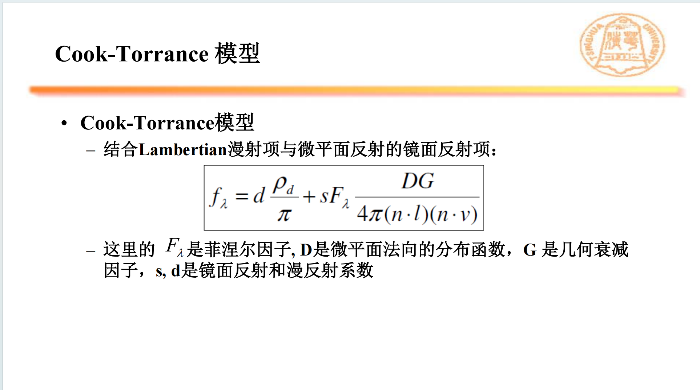

如果你看到这里，先不要照着这个公式实现。因为**这个公式的分母(n·l)(n·v)可能为0**。后续我们通过对G的定义，能够将分母的这两项消掉。

这个ppt中，前一项是一个三维向量，后一项是一个常数。怎么相加呢？**将向量的每一个分量都加上这个常数**。

还记得前面讲过，`pathTracer`里面递归结果乘的`hit_color`，可以理解为三个分量的衰减率吗？如果我们把glossy的第二项也理解为一个衰减率，那么就要在每一分量上都加上这个分量。

然后，我们要计算其中的 `F  D  G`

#### 4.2.5 glossy 具体分量的计算：F  D  G
F，即菲涅尔项，同样利用schlick近似计算。使用到的参数为：向量n、向量v（具体的定义见前面）。其中F0项本身就只和交点处的折射率有关，而折射率又是我们通过输入文件来决定的。所以为了简便，我这里直接将F0设置为一个常数。

D，法向分布函数，参考下面的公式计算：
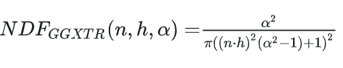

其中 n、h的定义和前面相同，α是粗糙度

G，参考知乎帖子，对G的定义如下：
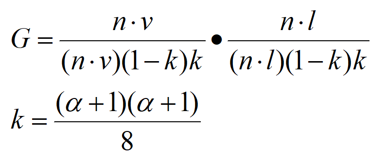

然后，G的分子上的(n·v)(n·l)，与glossy总体公式的分母上的正好消掉。

**消除(n·v)(n·l)非常重要**。如果我们对一个球实现glossy，在球的边缘处，(n·v)(n·l)可能近似为零，最后得到glossy的结果为NAN，就会导致在glossy的球的边缘处出现白圈。

所以，我们对G的计算，直接将分子设为1，在最后总体的计算，把分母上对应的部分消掉。

#### 4.2.6 glossy最终的公式计算
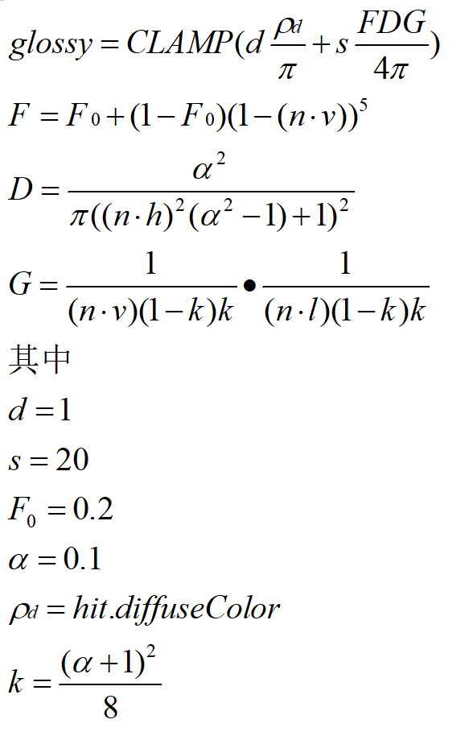

**CLAMP的定义：将向量的每一个分量截断至[0,1]区间，小于则置0，大于则置1**

CLAMP的过程至关重要！！！因为`glossy`函数最终的结果依然是**衰减率**，而衰减率一定要是在[0,1]区间内。如果没有CLAMP，你的图片可能会出现一些白点，就是因为把递归返回的颜色（能量）放大了，最终放大到(1,1,1)，即为白色。

**再次重申：向量与常数的相加定义为：向量的每一个分量加上这个常数**

上面的公式可能多除了一个pi，不过这个只是一个常数，是可以通过调整s的数值来弥补的。对最终的结果影响很小。

### 4.3 Next Event Estimation
NEE主要用于替换`pathTracer`代码中的漫反射的部分。其作用是在更少的spp的情况下，能有更好的效果（当然会更慢）。请参考`NEE.hpp`文件。

#### 4.3.1 NEE的概念
NEE的部分，参考二百多行的smallpt代码实现。

在漫反射的部分，我们计算出交点和出射光线方向后，从交点遍历每一个光源。

由于我们使用的是面光源，即在`material`类中加入`emission`项，所以我们需要在读取场景的时候，就把所有能够发光的物体（即光源）额外保存下来。这一步详见`group.hpp`文件。

然后对每一个光源，我们从光源上随机取一个点，判断从光源到交点的光线是否被其他物体遮挡。如果被遮挡，则其贡献为0；如果没有被遮挡，则按照公式计算其贡献。计算的部分请自行阅读代码。

我们可以看到，NEE的`pathTracer`多了一个参数E，用来标识该次递归是否考虑交点处的自发光项。如果该层递归考虑了，且使用了NEE，则下一层递归不再考虑。这个我也没搞懂，反正是照着smallpt写的。

### 4.4 运动模糊：以球为例

#### 4.4.1 概念讲解
什么是运动模糊呢？一个确定的光线打出后，球移动了一定的距离，所以光线与球的交点，相比较于原本应当的交点，有了一个偏移。相对来说，就是光线沿物体速度的方向平移了，产生了新的交点。光线的平移，即光线源点的移动，而光线方向不变。

然而，如果平移的距离是固定的，只会让球在画面中移动，不会产生模糊的效果。

所以，平移的距离不能是固定的，而要是随机的。

#### 4.4.2 实现细节
如果只做球的运动模糊，只需要修改`sphere`类（当然还有sceneparser类）。

既然有“运动”，那么就要有速度，是一个三维向量。所以要在`sphere`类中加入变量速度。

然后，在`intersect`函数中，从参数中的光线ray，加入扰动，构造新的光线r。r的方向与ray一致，源点应当是ray加入speed乘[0,1]的随机数作为扰动。然后我们计算新的光线r与球的交点，将结果返回。

注意，我们不应该对参数中的光线ray做出修改。


### 4.5 景深相机   
景深相机需要在`camera.hpp`中加入一个新的类，作为景深相机。

景深与镜头使用光圈、镜头焦距、拍摄距离以及对像质的要求（表现为对容许弥散圆的大小）有关。这些因素对景深的影响如下：

1. 镜头光圈：光圈越大，景深越小；光圈越小，景深越大；

2. 镜头焦距：镜头焦距越长，景深越小；焦距越短，景深越大；

3. 拍摄距离：距离越远，景深越大；距离越近，景深越小。

所以对于景深相机类，需要两个新的参数：
```
float aperture;          // 光圈直径
float focalLength;       // 焦距
```

在generateRay中，
1. 在光圈上随机选点，将相机中心加光圈上的点，作为光线的出发点（1）。
2. 计算出相机和像素连线与焦平面的交点2
3. 将出发点（1）到交点2作为光线的方向。

具体的实现和原理请自行查阅。

### 4.6 纹理贴图
材质有了贴图后，该从什么地方获取颜色呢？（原来获取交点的颜色是直接读取`material`类的`diffuseColor`）

这里参考了学长的思路：

1. 在`hit`类中，加入新的变量`color`，代表交点处的颜色。这个变量并不是读入的，而是在求交函数中计算得到颜色，并赋值给它的。

2. 在每个物体的求交函数中，求得交点后对`hit`中的color赋值：如果该物体的`material`没有贴图，则赋值为`diffuseColor`；否则，将交点的三维坐标映射到图片的二维，返回图片在二维的颜色。

那么需要有两个步骤：
1. 如何根据图片的二维返回图片对应位置的颜色

2. 如何将三维坐标映射到二维

#### 4.6.1 根据二维求得图片对应位置的颜色
这里我们约定，我们的“二维”是两个[0, 1]的分量，代表着在横轴、纵轴上占图片总长的比例。

具体的实现请参考`texture.hpp`和`texture.cpp`。

构造函数的主要作用是读取图片的信息。其使用了`stb_image.h`文件，这是一个外部的文件，你可以直接把它复制过去使用。

```
Vector3f Texture::getColor(const Vector2f &uv) const;

这个函数的作用是，使用双线性插值的方法，计算图片上[u, v]位置的颜色。
注：uv的两个分量都是[0,1]代表着在图片的横轴、纵轴上所占的比例。
```

```
Vector3f Texture::getColor(int x, int y) const;

这个函数的作用是：根据一个具体的坐标，得到对应像素点的颜色。
注：这里x, y的值域分别是：[0, width], [0, height]。其中width，height都是贴图的宽度和高度。
```

这个实现比较简单，请各位自行阅读代码。
#### 4.6.2 从三维到二维
我实现了平面、球、曲面三种物体的贴图。在三个类中，我们都要将世界坐标系中的三维坐标，转换为两个比例u，v，代表着在贴图中所占的比例。

1. 平面：需要在构造函数中，确定平面的横轴的方向和纵轴的方向，然后套公式即可。

2. 球：将水平的一个圆周（纬线）映射到图片的横轴，映射位置与角度有关，角度值域为[0, 2pi]。纵向的半圆周（经线）映射到图片的纵轴。

3. 曲面：将曲面的水平圆周和圆一样处理，竖直方向与平面一样处理。

### 4.7 参数曲面求交
这个我实现的有问题。我仅将个人浅显的认知说出来抛砖引玉。

注：习题课中关于这一部分的讲解，坐标的对应关系并不正确。请以下面的为准。

**在大作业中，我们的世界坐标的方向是：y轴竖直向上，x-z平面是水平平面。**

#### 4.7.1 总体思路
我们先回忆以下参数曲线，是二维的，并且有一个参数t，能够计算出对应的点的二维坐标。

旋转曲面就是将曲线沿y轴旋转一周，所以旋转曲面的曲线的点的二维坐标(x, y)，在三维世界坐标中应当为(xcosθ, y, xsinθ).

所以可以理解为，参数曲线的t对应了一组二维曲线的坐标(x, y)，而这里的x在三维世界中对应的是旋转曲面一个水平截面圆的半径。

那么我们的牛顿迭代的过程，计算的是什么呢？是参数曲线的t，可以理解为计算旋转曲面的无数个水平截面圆中，距离光线最近的一个。

得到圆的半径（对应参数曲线的x坐标）和高度（对应参数曲线的y坐标）之后，我们再通过方程计算光线上的交点的tr（即ray.origin + tr * ray.direction是交点的三维坐标）。

#### 4.7.2 迭代方程推导

我们将光线的方向向量记为D，光线的源点记为O，光线交点的参数为tr (O + tr * D是交点在世界坐标系下的坐标)

D, O 的三个分量分别记为 Dx,Dy,Dz, Ox,Oy,Oz

参数曲线的二维坐标系的坐标为(x(t), y(t))，参数曲线的曲线参数为t。其中x(t)，y(t)都是关于t的函数。

x, y的导数记为 dx, dy。dx，dy，以及x，y的计算，都是通过`curve.hpp`中的一个函数计算得到的。这里我是“参考”学长的代码的。我觉得你也可以“参考”我的，不过要慎重，这里有bug。

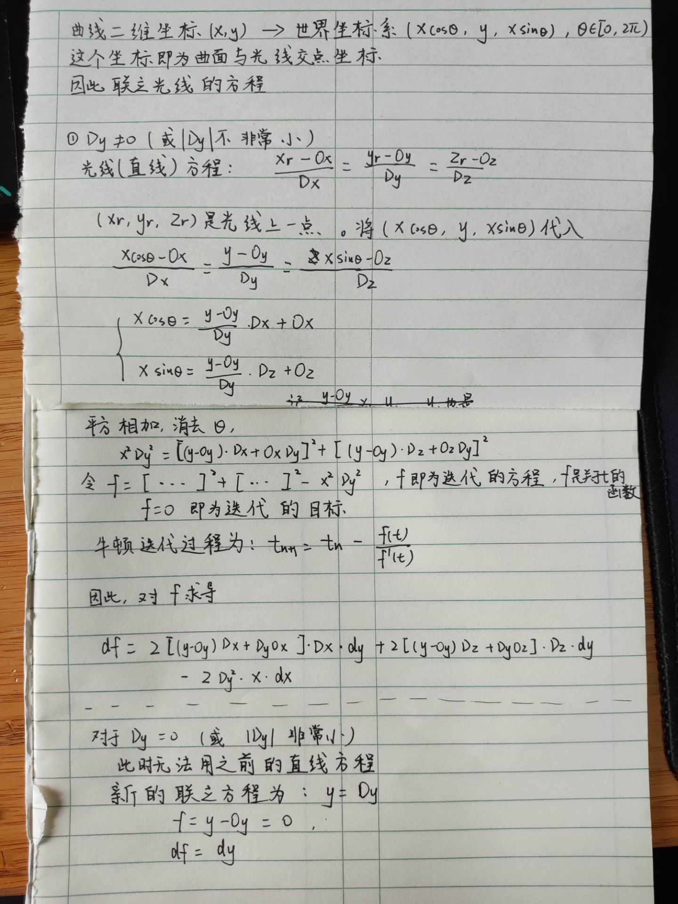

#### 4.7.3 迭代代码
在`revsurface.hpp`中，我的迭代方法如下：
1. 均匀的取一系列t值：0.1, 0.2, ... 0.9，分别进行迭代，直到收敛或者超出t的定义域（对于Bezier，应该是(0, 1)）
2. 对于上面的一系列t值，只取其中收敛的那些，分别计算该t值对应的交点的tr值，并取其中最小的tr值（当然要大于0）
3. 对于最小的tr值对应的坐标，即为交点，计算交点处的三维坐标和法向。

这里我没有参考习题课ppt（也是学长的）做法：先计算光线与包围盒的交点，然后以该交点作为牛顿迭代过程的初值。

主要是因为学长这样做有明显的bug。


